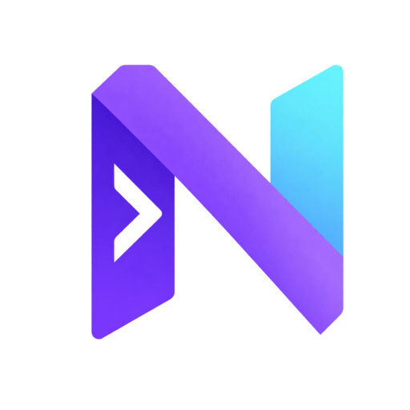
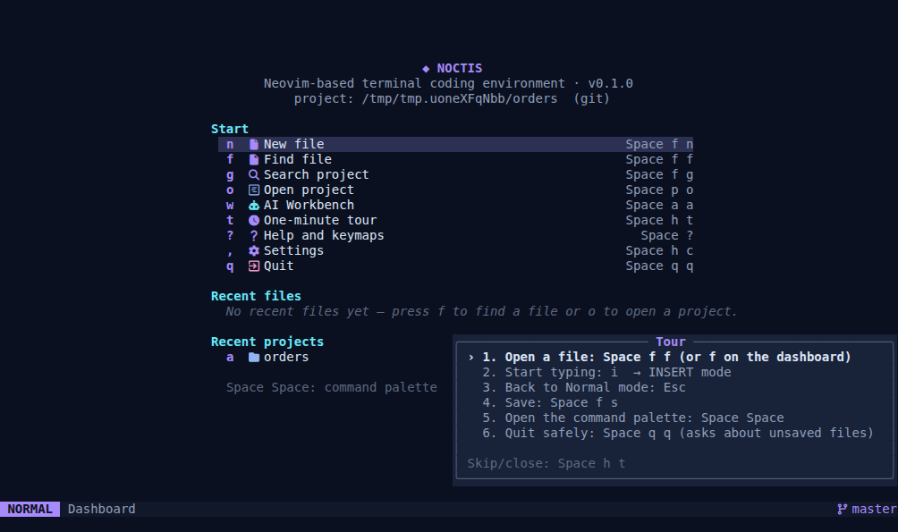
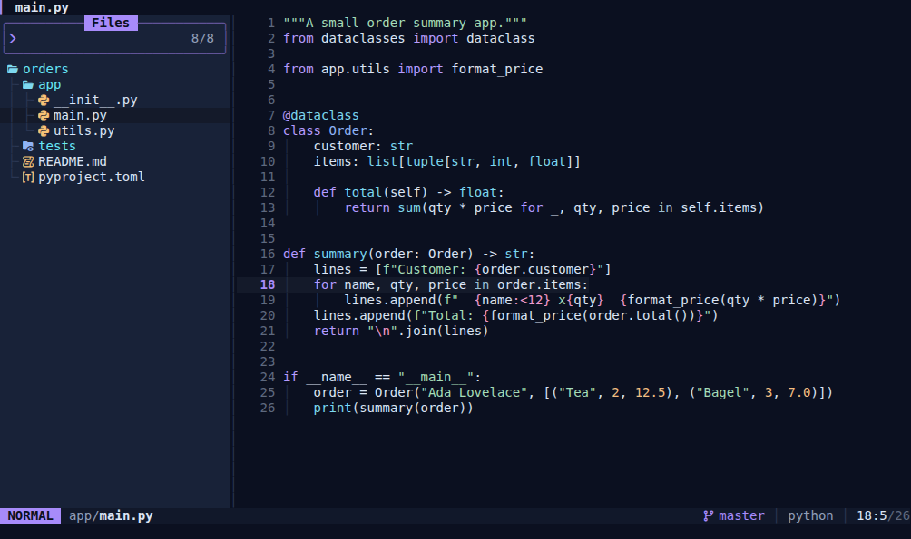
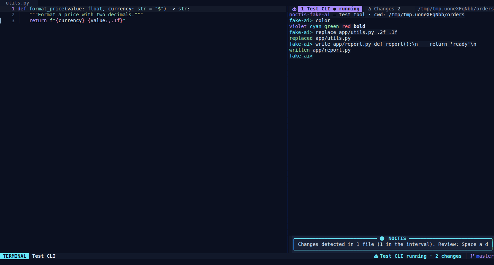
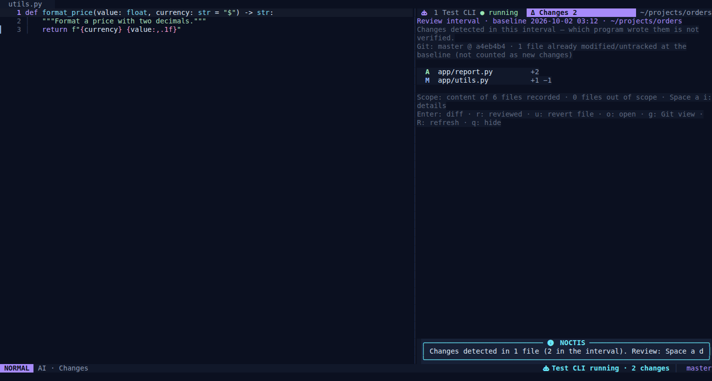
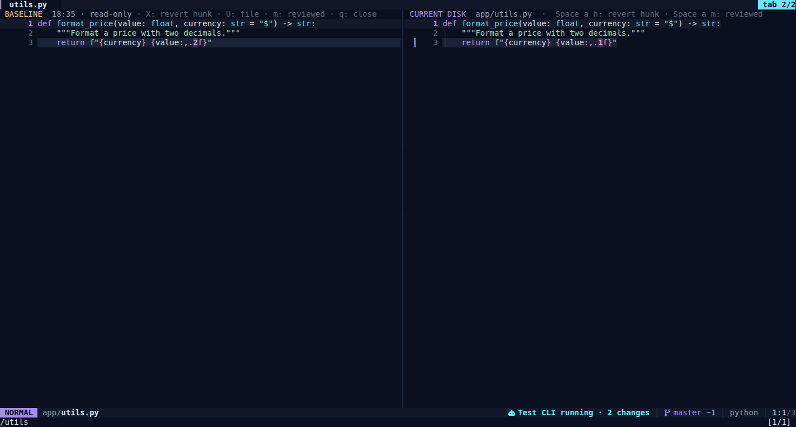
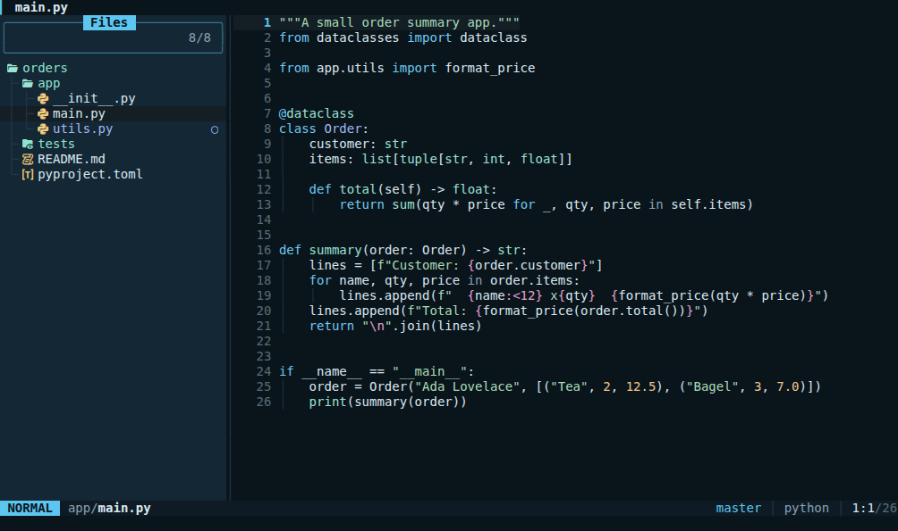
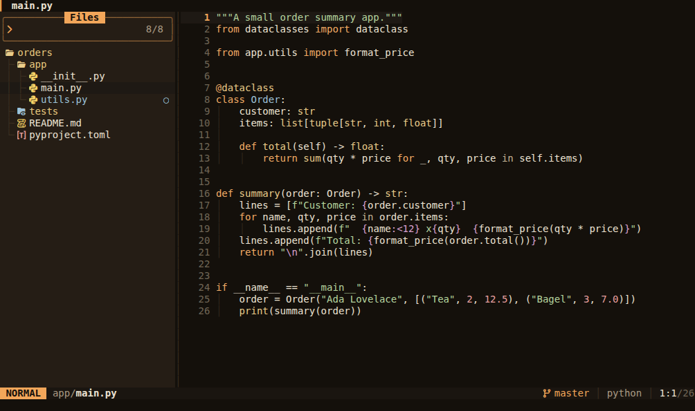
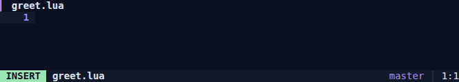

<p align="center">
  
</p>

<h1 align="center">NOCTIS</h1>

<p align="center">
  <b>A calm, AI-aware coding environment for the terminal — built on Neovim.</b>
</p>

<p align="center">
  
  
  
  
</p>

Open a project, find a file, write, see errors, run commands in a terminal,
review Git changes — and run AI tools such as Claude Code, Codex CLI, Kimi Code
or OpenCode on the same screen while watching every file change they make, live.

> **NOCTIS is a Neovim distribution.** It is not a new editor engine: text
> editing, undo, buffers/splits, the terminal and file I/O come from Neovim's
> mature core. NOCTIS adds its own Lua application layer, visual identity,
> command system, install tooling and the AI Workbench on top. It is inspired
> by LazyVim's terminal-first approach but contains none of LazyVim's code.



| Editor + explorer | AI Workbench (real PTY) |
| --- | --- |
|  |  |
| **Change list** | **Side-by-side diff** |
|  |  |
| **Glacier theme** | **Amber theme** |
|  |  |

Every image is captured from NOCTIS running in a real PTY (tmux) — these are
not design mockups. How: [`tests/visual/`](tests/visual/). More images:
[`docs/screenshots/`](docs/screenshots/).

## Highlights

- **Command palette** (`Space Space`): search any command by name, description
  or key. Commands that can't run right now are shown with the reason. The
  palette, keymaps, which-key help and the [keymap reference](docs/KEYMAPS.md)
  are all generated from a single command registry.
- **Midnight Violet** theme plus **Glacier** and **Amber** variants built from
  the same design tokens; 256-color fallback when truecolor is missing; fully
  usable without a Nerd Font.
- **Typing animation**: each character you type glows briefly in the accent
  color and fades out (~240 ms). Only the background is animated, so syntax
  colors stay intact. Skipped for pastes, macros and big files; toggle with
  `Space u a` or `ui.typing_animation = false`.

  

- **AI Workbench**: AI CLIs run in real terminal sessions pinned to the
  project root. Before a tool starts, NOCTIS records the project's **on-disk
  content** as a baseline; every later file change is tracked, reviewed as a
  side-by-side or unified diff, and can be **safely** reverted per hunk or per
  file. Details: [docs/AI-WORKBENCH.md](docs/AI-WORKBENCH.md).
- **Data safety**: an unsaved buffer is never silently overwritten by an
  external change (a 3-way merge is offered), deletes are recoverable (NOCTIS
  trash), persistent undo and swap recovery are on, CRLF and UTF-8 are
  preserved.
- **No network on startup**: plugins are downloaded only by `noctis --setup`,
  pinned to the commits in the lockfile. A normal launch makes no network
  requests.
- **Measured speed**: first screen in ~41 ms warm, ~70 ms cold
  ([method and results](docs/PERFORMANCE.md)).

## Requirements

| Component | Status | Notes |
| --- | --- | --- |
| Neovim **≥ 0.12.0** | required | Tested on 0.12.4. Distro packages are often older: [Neovim releases](https://github.com/neovim/neovim/releases) |
| git | required | plugin install, Git summary, merges |
| ripgrep (`rg`) | recommended | project search, search & replace, AI scope scan. Without it these commands are disabled with a reason |
| Nerd Font | optional | otherwise set `icons = false` |
| lazygit | optional | otherwise the built-in NOCTIS Git summary is used |
| tree-sitter CLI ≥ 0.26.1 + C compiler | optional | for Tree-sitter parsers; otherwise Vim syntax highlighting |
| Language servers / formatters | optional | installed per language pack, on request (`:NoctisLang`) |
| Claude Code / Codex CLI / Kimi Code / OpenCode | optional | for the AI Workbench; the editor works fine without them |

`noctis --doctor` checks all of the above.

## Installation

```sh
git clone https://github.com/abdulhalimaltuntas/noctis.git
cd noctis
scripts/install.sh
```

The script runs in user space (no root) and **never installs system
packages**; it lists missing components with commands for your platform.

- App: `~/.local/share/noctis/app` · Launcher: `~/.local/bin/noctis`
- Your settings (`~/.config/noctis/config.lua`), sessions and AI records are
  **kept** across reinstalls. A `noctis` file that NOCTIS doesn't own is never
  overwritten (`--force` overwrites it after making a backup).
- At the end, the plugins to download (with their lockfile commits) are listed
  and you are asked to confirm. Language servers, formatters and parsers are
  **not** downloaded; you pick them inside NOCTIS with `:NoctisLang`.

Options: `--no-setup` (download plugins later with `noctis --setup`), `--yes`,
`--bin-dir DIR`, `--force`.

Thanks to `NVIM_APPNAME=noctis`, configuration, data, state and cache are
fully separate from your regular Neovim; your `~/.config/nvim` is never moved
or modified. An `nvim` started from a terminal inside NOCTIS uses your own
config (NOCTIS environment variables don't leak into child processes).

**Try it without installing:** the launcher in the repo runs directly:
`bin/noctis --setup`, then `bin/noctis`.

## Usage

```sh
noctis                 # dashboard
noctis .               # open a folder as a project (explorer opens)
noctis src/main.py     # open a file (skips the dashboard)
noctis +42 src/main.py # open at line 42
noctis -- -dashed.txt  # everything after '--' is a file name
noctis --doctor        # installation, dependency and AI profile check
noctis --safe          # basic editing without third-party plugins
noctis --setup         # download/repair plugins from the lockfile
noctis --help
```

Wrapper flags are recognized only before the first `--`; all other arguments
are passed to Neovim unchanged. The editor's exit code is preserved.

## First steps

On first launch a skippable **one-minute tour** appears in the corner (it
doesn't steal focus; steps complete as you actually do them; toggle with
`Space h t`): open a file → type with `i` → back to Normal mode with `Esc` →
save → command palette → safe quit.

NOCTIS keeps modal editing: **NORMAL** (navigate/command), **INSERT**
(typing), **VISUAL** (selection). The mode is shown in the statusline as both
text and color.

| Key | Action |
| --- | --- |
| `Space Space` | Command palette |
| `Space f f` / `Space f g` / `Space f b` | Find file / search project / open buffers |
| `Space f s` | Save (asks first if the file changed on disk) |
| `Space e` | File explorer |
| `Space b d` | Close buffer safely |
| `Space q q` | Quit, showing unsaved files and running processes |
| `Space t t` | Terminal panel (hiding it doesn't kill the process) |
| `Space a a` / `a n` / `a s` / `a d` / `a c` | AI Workbench / new session / switch session / changes / new baseline |
| `Space g g` | Git view |
| `Space c a` / `c r` / `c f` | Code action / rename / format |
| `Space x x` | Diagnostics list |
| `Space u t` / `u z` / `u a` | Theme / focus mode / typing animation |
| `Space ?` | Help and keymaps |

Full list: [docs/KEYMAPS.md](docs/KEYMAPS.md) or `:NoctisKeys` inside NOCTIS.
Press `Space` and wait a moment for grouped key hints. In Insert mode the space
bar behaves normally.

**Leaving the terminal and AI panel:** in a terminal, `Esc` and `Ctrl-C` go to
the running program (shell, AI tool). Use `Ctrl-\ e` to return to the editor,
and `Ctrl-\ Ctrl-n` for Normal mode to scroll/copy inside the terminal.

## Configuration

User settings live in `~/.config/noctis/config.lua` (open it with
`Space h c`; it's created from an annotated example if missing). Updates never
touch this file. All options: [`app/examples/config.lua`](app/examples/config.lua).

```lua
return {
  theme = "glacier",                 -- midnight-violet | glacier | amber
  icons = false,                     -- no Nerd Font
  ui = { typing_animation = false }, -- turn the typing glow off
  format_on_save = { enabled = true, filetypes = { "python", "lua" } },
  keymaps = { ["files.grep"] = "<leader>/", ["ui.focus"] = false },
  ai = { profiles = { aider = { label = "Aider", cmd = { "aider" } } } },
}
```

Invalid values are reported at startup with an explanation and replaced by the
defaults; a file with a syntax error never prevents the editor from opening.

## Language packs

Python, JavaScript/TypeScript, HTML/CSS, JSON, Lua and Bash packs are defined.
Each pack lists the **language server, Tree-sitter parser and formatter** it
needs (`Space h l` or `:NoctisLang`). Nothing is downloaded on its own:
`:NoctisLang install python` shows what will be downloaded and asks for
confirmation (via Mason and nvim-treesitter; needs network), or you can use the
system install hint on each line. Only servers whose executable is found are
started; files without a language server open and edit normally.

Format-on-save is **off** by default and can be enabled per filetype. Only one
formatter runs per save; errors and timeouts never block the save — they
produce a visible notification.

## Updating and rolling back

```sh
cd noctis && git pull && scripts/install.sh
```

Plugin versions are pinned by `app/lazy-lock.json`. A normal launch never
checks for or downloads updates. To update plugins deliberately, run
`:Lazy update` inside NOCTIS; to go back to the lockfile versions, use
`:Lazy restore` or `noctis --setup`. To go back to an earlier NOCTIS release,
check out that commit/tag and run `scripts/install.sh` (the lockfile follows).

## Safe mode and troubleshooting

- **`noctis --safe`** skips plugins and the download bootstrap; basic editing,
  the theme, statusline, command palette (with the built-in picker) and the
  netrw explorer still work. Use it to isolate a plugin problem.
- **`noctis --doctor`**, or **`Space h h`** inside NOCTIS (`:checkhealth noctis`).
- Log: `~/.local/state/noctis/noctis.log` (respects `XDG_STATE_HOME`).

| Symptom | Fix |
| --- | --- |
| "Plugins are not installed yet" warning | `noctis --setup` (needs network). Meanwhile the editor runs in basic mode |
| Icons show as boxes/question marks | Install a Nerd Font or set `icons = false` |
| Colors look washed out or wrong | Your terminal may not support 24-bit color; `truecolor = false` uses the 256-color fallback |
| Copy/paste doesn't reach the system clipboard | Linux: `wl-clipboard` or `xclip`; over SSH, a terminal with OSC 52 support |
| A language server doesn't start | `:NoctisLang` shows what's missing and how to install it |
| AI tool "not found" | The panel shows the official install command; for a custom location use `ai.profiles.<name>.cmd` |
| AI changes show up late | `noctis --doctor` shows the inotify quota: `sudo sysctl fs.inotify.max_user_watches=524288` |
| Parser download fails with 403/timeout | Your network/proxy may block `codeload.github.com`; without a parser, Vim syntax highlighting is used |

## Uninstalling

```sh
scripts/uninstall.sh          # launcher, app, plugins, cache
scripts/uninstall.sh --purge  # + settings and state (sessions, undo, AI records, trash)
```

Everything to be removed is listed first and you are asked to confirm. Only
directories managed by NOCTIS (XDG paths ending in `…/noctis` and the marked
launcher) are targeted; your projects are never touched.

## Platform status

| Platform | Status |
| --- | --- |
| Linux (x86_64), Neovim 0.12.4 | **Tested** (automated tests in this repo + real-PTY visual verification) |
| macOS | Not tested. The code relies on POSIX tools; file watching is written per directory but hasn't been verified there |
| Windows (WSL 2) | Not tested. The Linux path is expected to work; inotify events are unreliable across the WSL filesystem boundary (`/mnt/c`) |
| Windows (native) | Not supported (not a goal for the first release) |

Detailed verification list: [docs/COMPATIBILITY.md](docs/COMPATIBILITY.md).

## Tests

```sh
tests/run.sh                               # all offline tests (launcher, core, AI tracking, safe mode)
tests/run.sh --plugins                     # + plugin UI and real language server (pyright) tests
DATA=… tests/perf.sh                       # startup time measurement
DATA=… FONTS=… tests/visual/capture.sh     # real-PTY screenshots (demo from make-demo.sh)
DATA=… FONTS=… tests/visual/typing-gif.sh  # the typing animation GIF
```

Each suite runs with temporary XDG directories and never touches your setup.
AI tracking is verified with a deterministic test CLI
([`tools/noctis-fake-ai`](tools/noctis-fake-ai)) that never connects to a real
AI service.

## Documentation

- [AI Workbench guide](docs/AI-WORKBENCH.md) — profiles, project binding, focus, review, revert, scope
- [Architecture and dependency rationale](docs/ARCHITECTURE.md)
- [Verification and compatibility](docs/COMPATIBILITY.md)
- [Performance measurement](docs/PERFORMANCE.md)
- [Keymaps and commands](docs/KEYMAPS.md)
- [Changelog](CHANGELOG.md)
- [Third-party components and licenses](THIRD_PARTY.md)

## Contributors

<table>
  <tr>
    <td align="center">
      <a href="https://github.com/abdulhalimaltuntas">
        <br>
        <b>Abdulhalim Altuntaş</b>
      </a><br>
      <sub>Creator · product direction</sub>
    </td>
    <td align="center">
      <a href="https://claude.com/claude-code">
        <br>
        <b>Claude</b>
      </a><br>
      <sub>AI pair programmer · implementation</sub>
    </td>
  </tr>
</table>

Contributions are welcome — open an issue to discuss larger changes first, and
run `tests/run.sh` before sending a pull request.

## Name and license

"NOCTIS" is a working product name; it hasn't been checked as a unique
trademark. The name, command and `NVIM_APPNAME` are defined in a single file:
[`app/BRAND`](app/BRAND).

Copyright 2026 Abdulhalim Altuntaş. NOCTIS is licensed under the
[Apache License 2.0](LICENSE) (see also [NOTICE](NOTICE)). Plugins are
downloaded from their own repositories at install time and are distributed
under their own licenses (Apache-2.0 / MIT): [THIRD_PARTY.md](THIRD_PARTY.md).
