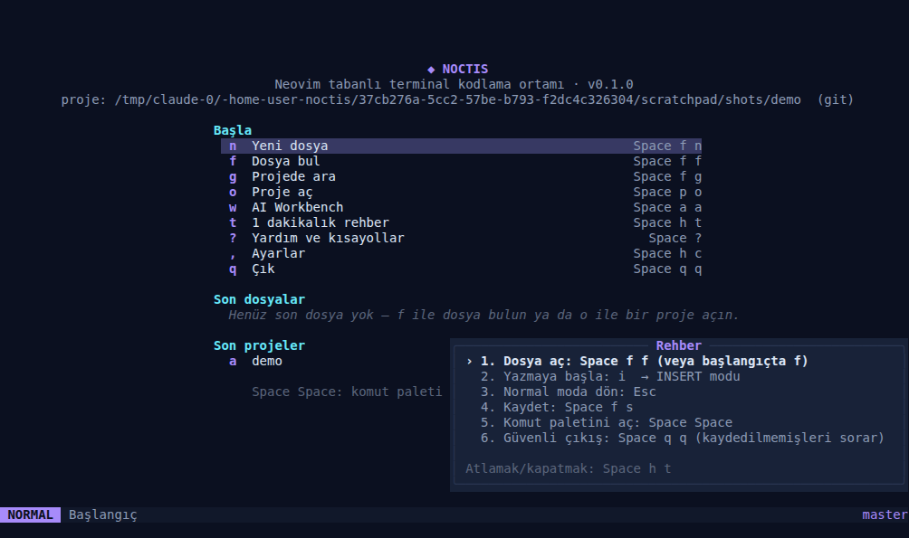
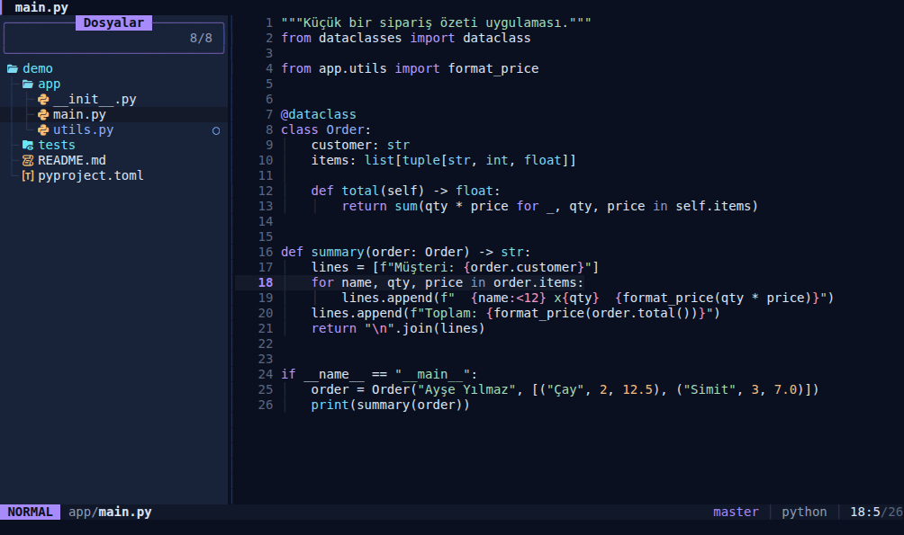
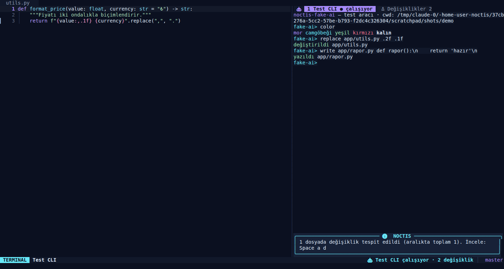
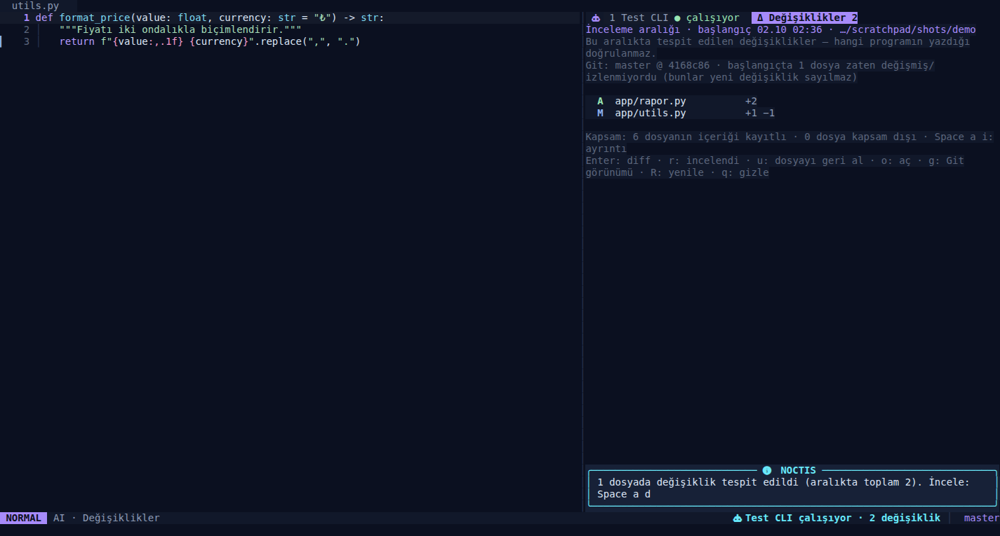
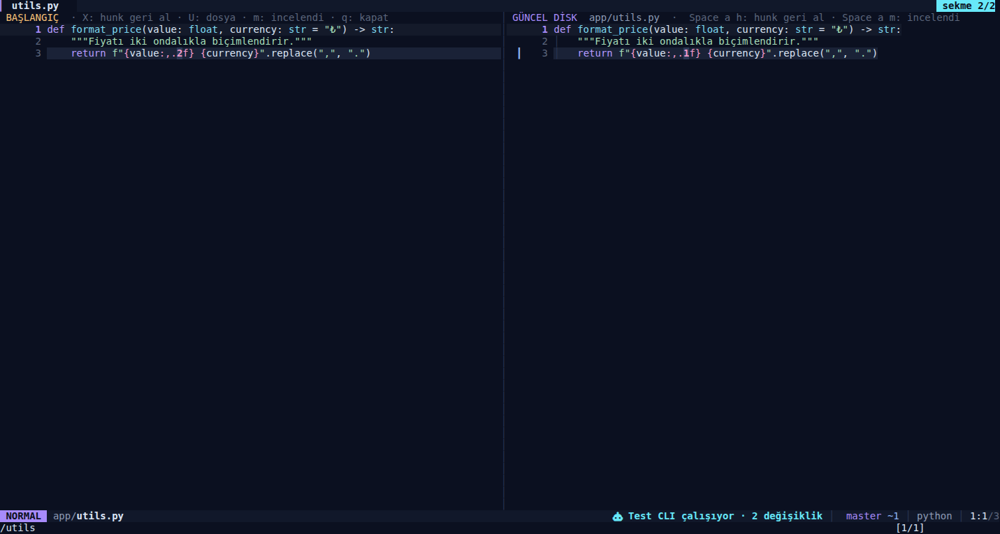

# NOCTIS

Terminalde düşük zihinsel yükle kod yazmak için bir çalışma ortamı: proje aç,
dosya bul, yaz, hataları gör, terminalde komut çalıştır, Git değişikliklerini
incele — ve aynı ekranda Codex CLI, Claude Code veya Kimi Code gibi AI
araçlarını çalıştırıp dosyalara yaptıkları değişiklikleri canlı izle.

> **NOCTIS, Neovim tabanlı bir dağıtımdır.** Yeni bir editör motoru değildir:
> metin düzenleme, undo, buffer/split, terminal ve dosya işlemleri Neovim'in
> olgun altyapısıyla yapılır. NOCTIS bunun üzerine kendi Lua uygulama katmanını,
> görsel kimliğini, komut sistemini, kurulum araçlarını ve AI Workbench'i ekler.
> LazyVim'in terminal odaklı yaklaşımından ilham alır; LazyVim'in kaynak
> kodunu içermez.



| Editör + gezgin | AI Workbench (gerçek PTY) |
| --- | --- |
|  |  |
| **Değişiklik listesi** | **Yan yana diff** |
|  |  |

Tüm görüntüler NOCTIS'in gerçek bir PTY'de (tmux) çalışırken yakalanan ekran
içeriğidir; tasarım mockup'ı değildir. Yöntem: [`tests/visual/`](tests/visual/).
Diğer görüntüler: [`docs/screenshots/`](docs/screenshots/).

## Öne çıkanlar

- **Komut paleti** (`Space Space`): her komut adı, açıklaması veya kısayoluyla
  aranır; kullanılamayan komutlar gerekçesiyle gösterilir. Palet, kısayollar,
  which-key yardımı ve [kısayol belgesi](docs/KEYMAPS.md) tek kaynaktan üretilir.
- **Midnight Violet** teması ve aynı tasarım sisteminden **Glacier**, **Amber**
  varyantları; truecolor yoksa 256 renk yedeği; Nerd Font olmadan tam çalışma.
- **AI Workbench**: AI CLI'leri gerçek terminal oturumlarında, sabit proje
  kökünde çalışır. Araç ilk kez başlamadan önce projenin **disk içeriği**
  başlangıç kaydı olarak alınır; sonraki her dosya değişikliği izlenir, yan
  yana/birleşik diff ile incelenir, hunk veya dosya bazında **korumalı** geri
  alınır. Ayrıntı: [docs/AI-WORKBENCH.md](docs/AI-WORKBENCH.md).
- **Veri güvenliği**: kaydedilmemiş buffer dışarıdan gelen değişiklikle asla
  ezilmez (3 yollu birleştirme sunulur), silme geri alınabilir (NOCTIS çöp
  kutusu), kalıcı undo ve swap kurtarma açıktır, CRLF ve UTF-8 korunur.
- **Ağ gerektirmeyen açılış**: eklentiler yalnız `noctis --setup` ile, kilit
  dosyasındaki sürümlerle indirilir. Normal açılış ağ isteği yapmaz.
- **Ölçülmüş hız**: ilk ekran sıcak açılışta ~41 ms, soğuk ~70 ms
  ([ölçüm yöntemi ve sonuçlar](docs/PERFORMANCE.md)).

## Ön koşullar

| Bileşen | Durum | Not |
| --- | --- | --- |
| Neovim **≥ 0.12.0** | gerekli | 0.12.4 üzerinde test edildi. Dağıtım paketleri çoğunlukla eskidir: [neovim releases](https://github.com/neovim/neovim/releases) |
| git | gerekli | eklenti kurulumu, Git özeti, birleştirme |
| ripgrep (`rg`) | önerilir | projede arama, toplu değiştirme, AI kapsam taraması. Yoksa bu komutlar gerekçeyle devre dışı görünür |
| Nerd Font | isteğe bağlı | yoksa `icons = false` |
| lazygit | isteğe bağlı | yoksa NOCTIS Git özeti kullanılır |
| tree-sitter CLI ≥ 0.26.1 + C derleyici | isteğe bağlı | Tree-sitter parser'ları için; yoksa Vim söz dizimi vurgusu |
| Dil sunucuları / formatter'lar | isteğe bağlı | dil paketi başına seçerek kurulur (`:NoctisLang`) |
| Codex CLI / Claude Code / Kimi Code | isteğe bağlı | AI Workbench için; yoksa editör normal çalışır |

`noctis --doctor` bunların tamamını denetler.

## Kurulum

```sh
git clone https://github.com/abdulhalimaltuntas/noctis.git
cd noctis
scripts/install.sh
```

Script kullanıcı alanında çalışır (root gerekmez), sistem paketi **kurmaz**;
eksik bileşenleri platformunuza uygun komutlarla listeler.

- Uygulama: `~/.local/share/noctis/app` · Başlatıcı: `~/.local/bin/noctis`
- Ayarlarınız (`~/.config/noctis/config.lua`), oturumlar ve AI kayıtları
  yeniden kurulumda **korunur**. NOCTIS'e ait olmayan bir `noctis` dosyasının
  üzerine yazılmaz (`--force` ile ve yedekleyerek yazılabilir).
- Kurulumun sonunda indirilecek eklentiler (kilit dosyasındaki commit'leriyle)
  listelenir ve onay istenir. Dil sunucuları, formatter'lar ve parser'lar
  **indirilmez**; NOCTIS içinde `:NoctisLang` ile seçerek kurulur.

Seçenekler: `--no-setup` (eklentileri sonra `noctis --setup` ile indir),
`--yes`, `--bin-dir DİZİN`, `--force`.

`NVIM_APPNAME=noctis` sayesinde yapılandırma, veri, durum ve önbellek normal
Neovim kurulumunuzdan tamamen ayrıdır; mevcut `~/.config/nvim` taşınmaz veya
değiştirilmez. NOCTIS içindeki terminallerde çalıştırılan `nvim` kendi
yapılandırmanızı kullanır (NOCTIS ortam değişkenleri alt süreçlere sızmaz).

**Kurulum yapmadan denemek:** depo içindeki başlatıcı doğrudan çalışır:
`bin/noctis --setup` ve ardından `bin/noctis`.

## Başlatma

```sh
noctis                 # başlangıç ekranı
noctis .               # klasörü proje olarak aç (gezgin açılır)
noctis src/main.py     # dosyayla aç (başlangıç ekranı araya girmez)
noctis +42 src/main.py # 42. satırda aç
noctis -- -tireli.txt  # '--' sonrası her şey dosya adıdır
noctis --doctor        # kurulum, bağımlılık ve AI profil denetimi
noctis --safe          # üçüncü taraf eklentiler olmadan temel düzenleme
noctis --setup         # eklentileri kilit dosyasına göre indir/onar
noctis --help
```

Wrapper bayrakları yalnız ilk `--` öncesinde tanınır; diğer tüm argümanlar
Neovim'e değiştirilmeden aktarılır. Editörün çıkış kodu korunur.

## İlk kullanım

İlk açılışta köşede atlanabilir bir **bir dakikalık rehber** belirir (odak
almaz; adımlar gerçek eylemlerle tamamlanır, `Space h t` ile açılıp kapanır):
dosya aç → `i` ile yaz → `Esc` ile Normal moda dön → kaydet → komut paleti →
güvenli çıkış.

NOCTIS modal düzenlemeyi korur: **NORMAL** (gezinme/komut), **INSERT**
(yazma), **VISUAL** (seçim). Mod, statusline'da hem metin hem renkle gösterilir.

| Kısayol | İşlem |
| --- | --- |
| `Space Space` | Komut paleti |
| `Space f f` / `Space f g` / `Space f b` | Dosya bul / projede ara / açık buffer |
| `Space f s` | Kaydet (disk dışarıdan değiştiyse önce sorar) |
| `Space e` | Dosya gezgini |
| `Space b d` | Buffer'ı güvenli kapat |
| `Space q q` | Kaydedilmemişleri ve çalışan süreçleri göstererek çık |
| `Space t t` | Terminal paneli (gizlemek süreci öldürmez) |
| `Space a a` / `a n` / `a s` / `a d` / `a c` | AI Workbench / yeni oturum / oturum değiştir / değişiklikler / yeni başlangıç |
| `Space g g` | Git görünümü |
| `Space c a` / `c r` / `c f` | Code action / yeniden adlandır / biçimlendir |
| `Space x x` | Diagnostics listesi |
| `Space u t` / `u z` | Tema / odak modu |
| `Space ?` | Yardım ve kısayollar |

Tam liste: [docs/KEYMAPS.md](docs/KEYMAPS.md) veya NOCTIS içinde `:NoctisKeys`.
`Space` tuşuna basıp kısa süre beklemek gruplu kısayol yardımını açar.
Insert modda boşluk tuşu normal davranır.

**Terminal ve AI panelinden çıkış:** terminalde `Esc` ve `Ctrl-C` çalışan
programa (shell, AI aracı) gider. Editöre dönmek için `Ctrl-\ e`; terminalde
kaydırma/kopyalama için Normal moda geçmek `Ctrl-\ Ctrl-n`.

## Ayarlar

Kullanıcı ayarları `~/.config/noctis/config.lua` dosyasındadır (`Space h c`
ile açılır; yoksa açıklamalı örnekten oluşturulur). Güncellemeler bu dosyaya
dokunmaz. Tüm seçenekler: [`app/examples/config.lua`](app/examples/config.lua).

```lua
return {
  theme = "glacier",                 -- midnight-violet | glacier | amber
  icons = false,                     -- Nerd Font yoksa
  format_on_save = { enabled = true, filetypes = { "python", "lua" } },
  keymaps = { ["files.grep"] = "<leader>/", ["ui.focus"] = false },
  ai = { profiles = { aider = { label = "Aider", cmd = { "aider" } } } },
}
```

Geçersiz değerler açılışta açıklamalı olarak raporlanır ve yerlerine
varsayılan kullanılır; sözdizimi hatalı bir dosya editörü açılmaz hale getirmez.

## Dil paketleri

Python, JavaScript/TypeScript, HTML/CSS, JSON, Lua ve Bash paketleri tanımlıdır.
Her paket gereken **dil sunucusunu, Tree-sitter parser'ını ve formatter'ı**
açıkça listeler (`Space h l` veya `:NoctisLang`). Hiçbiri kendiliğinden
indirilmez: `:NoctisLang install python` indirilecekleri gösterip onay ister
(Mason ve nvim-treesitter ile; ağ gerekir) ya da satırdaki sistem kurulum
ipucunu kullanabilirsiniz. Yalnız executable'ı bulunan sunucular başlatılır;
dil sunucusu olmayan dosyalar normal açılır ve düzenlenir.

Kaydederken biçimlendirme varsayılan olarak **kapalıdır**; dosya türüne göre
açılır. Aynı kayıtta tek formatter çalışır; hata ve zaman aşımı kaydı
engellemez, görünür bildirim üretir.

## Güncelleme ve geri dönüş

```sh
cd noctis && git pull && scripts/install.sh
```

Eklenti sürümleri `app/lazy-lock.json` ile sabittir. Normal açılış güncelleme
denetlemez veya indirmez. NOCTIS içinde eklentileri bilinçli olarak
güncellemek için `:Lazy update`; kilit dosyasındaki sürümlere dönmek için
`:Lazy restore` veya `noctis --setup`. Önceki bir NOCTIS sürümüne dönmek için
depoda ilgili commit/etikete geçip `scripts/install.sh` çalıştırın
(kilit dosyası da o sürüme döner).

## Güvenli mod ve sorun giderme

- **`noctis --safe`**: eklentileri ve indirme önyüklemesini atlar; temel
  düzenleme, tema, statusline, komut paleti (yerleşik seçim listesiyle) ve
  netrw gezgini çalışır. Bir eklenti sorununu ayırmak için kullanın.
- **`noctis --doctor`** veya NOCTIS içinde **`Space h h`** (`:checkhealth noctis`).
- Log: `~/.local/state/noctis/noctis.log` (`XDG_STATE_HOME`'a uyar).

| Belirti | Çözüm |
| --- | --- |
| "Eklentiler henüz kurulmamış" uyarısı | `noctis --setup` (ağ gerekir). Editör o sırada temel modda çalışır |
| İkonlar kutu/soru işareti | Nerd Font kurun veya `icons = false` |
| Renkler soluk veya yanlış | Terminaliniz 24 bit desteklemiyor olabilir; `truecolor = false` 256 renk yedeğini kullanır |
| Kopyala-yapıştır sistem panosuna gitmiyor | Linux: `wl-clipboard` veya `xclip`; SSH'de OSC 52 destekleyen terminal |
| Dil sunucusu çalışmıyor | `:NoctisLang` eksik bileşeni ve kurulumunu gösterir |
| AI aracı "bulunamadı" | Panel resmi kurulum komutunu gösterir; farklı konum için `ai.profiles.<ad>.cmd` |
| AI değişiklikleri gecikmeli | `noctis --doctor` inotify kotasını gösterir: `sudo sysctl fs.inotify.max_user_watches=524288` |
| Parser indirmesi 403/zaman aşımı | Ağ/proxy `codeload.github.com`'u engelliyor olabilir; parser olmadan Vim söz dizimi kullanılır |

## Kaldırma

```sh
scripts/uninstall.sh          # başlatıcı, uygulama, eklentiler, önbellek
scripts/uninstall.sh --purge  # + ayarlar ve state (oturumlar, undo, AI kayıtları, çöp kutusu)
```

Silinecekler önceden listelenir ve onay istenir. Yalnız NOCTIS'in yönettiği
dizinler (`…/noctis` ile biten XDG yolları ve işaretli başlatıcı) hedeflenir;
projelerinize asla dokunulmaz.

## Platform durumu

| Platform | Durum |
| --- | --- |
| Linux (x86_64), Neovim 0.12.4 | **Test edildi** (bu depodaki otomatik testler + gerçek PTY görsel doğrulama) |
| macOS | Test edilmedi. Kod POSIX araçlarına dayanır; dosya izleme dizin başına çalışacak şekilde yazıldı ama doğrulanmadı |
| Windows (WSL 2) | Test edilmedi. Linux yolunun çalışması beklenir; WSL dosya sistemi sınırlarında (`/mnt/c`) inotify olayları güvenilir değildir |
| Windows (yerel) | Desteklenmiyor (ilk sürümün hedefi değil) |

Ayrıntılı doğrulama listesi: [docs/COMPATIBILITY.md](docs/COMPATIBILITY.md).

## Testler

```sh
tests/run.sh             # ağ gerektirmeyen tüm testler (launcher, çekirdek, AI takibi, güvenli mod)
tests/run.sh --plugins   # + eklentili arayüz ve gerçek dil sunucusu (pyright) testleri
DATA=… tests/perf.sh     # açılış süresi ölçümü
tests/visual/capture.sh  # gerçek PTY ekran görüntüleri
```

Her test paketi geçici XDG dizinleriyle çalışır; kurulumunuza dokunmaz.
AI takibi, gerçek bir AI hizmetine bağlanmayan deterministik bir test CLI'siyle
([`tools/noctis-fake-ai`](tools/noctis-fake-ai)) doğrulanır.

## Belgeler

- [AI Workbench rehberi](docs/AI-WORKBENCH.md) — profiller, proje bağlama, odak, inceleme, geri alma, kapsam
- [Mimari ve bağımlılık gerekçeleri](docs/ARCHITECTURE.md)
- [Doğrulama ve uyumluluk](docs/COMPATIBILITY.md)
- [Performans ölçümü](docs/PERFORMANCE.md)
- [Kısayollar ve komutlar](docs/KEYMAPS.md)
- [Üçüncü taraf bileşenler ve lisanslar](THIRD_PARTY.md)

## Ad ve lisans

"NOCTIS" geçici bir ürün adıdır ve benzersiz bir marka olduğu doğrulanmamıştır.
Ad, komut ve `NVIM_APPNAME` tek bir dosyada tanımlıdır: [`app/BRAND`](app/BRAND).

NOCTIS'in kendi kaynak kodu için henüz bir lisans seçilmemiştir; bu karar depo
sahibine aittir. Kullanılan eklentiler kurulum sırasında kendi depolarından
indirilir ve kendi lisanslarıyla (Apache-2.0 / MIT) dağıtılır:
[THIRD_PARTY.md](THIRD_PARTY.md).
